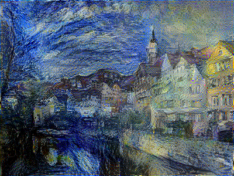

# Image Style Transfer Using Convolutional Neural Networks

Ce projet est une reproduction des résultats de l'article **"Image Style Transfer Using Convolutional Neural Networks"** publié par Gatys et al. Ce travail met en œuvre une méthode de transfert de style qui utilise des réseaux de neurones convolutifs (CNN) pour combiner le contenu d'une image et le style d'une autre afin de générer une nouvelle image stylisée.

## Contenu du projet

- **Notebook :** Mise en œuvre détaillée de l'algorithme en TensorFlow.
- **Images d'entrée :** Exemples d'images utilisées pour le contenu et le style.
- **Résultats :** Images générées par le modèle.

## Prérequis

Assurez-vous d'avoir installé les dépendances nécessaires avant d'exécuter le projet :

- Python 3.10+
- TensorFlow
- NumPy
- Matplotlib

Pour installer les bibliothèques, exécutez :

```bash
pip install -r requirements.txt
```

## Utilisation

1. Clonez le repository :
   ```bash
   git clone https://github.com/Kabotei/styleTransfer.git
   cd styleTransfer
   ```

2. Placez vos propres images de contenu et de style dans le dossier `dataset/`.


## Résultats

Voici un aperçu des résultats obtenus avec différentes combinaisons d'images :

| Contenu                | Style                  | Résultat             |
|------------------------|------------------------|----------------------|
|  |  |  |

## Références

- [Image Style Transfer Using Convolutional Neural Networks (2016)](https://www.cv-foundation.org/openaccess/content_cvpr_2016/papers/Gatys_Image_Style_Transfer_CVPR_2016_paper.pdf)

